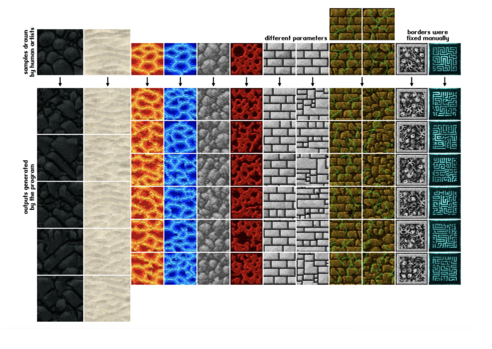
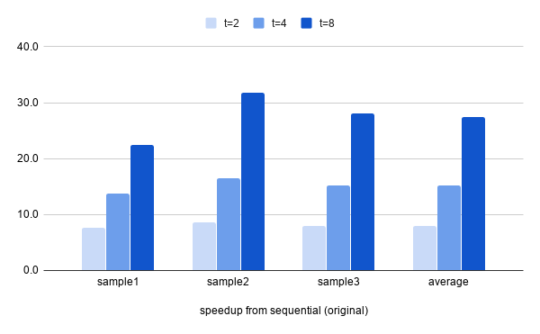
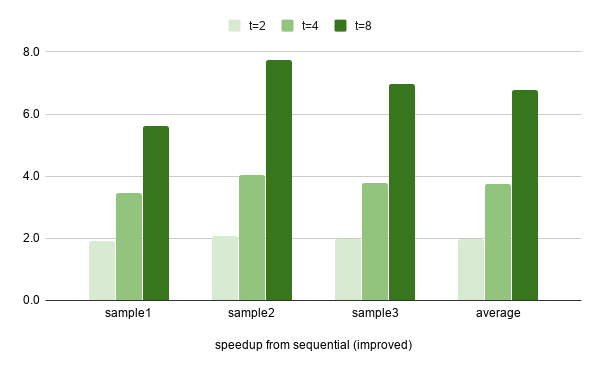

# Parallel Texture Synthesis with Non-parametric Sampling

## Summary

Texture synthesis is an image-generation technique commonly used to produce high-quality textures when rendering synthetic graphics. In this project we used multithreading with OpenMP in C++ to parallelize an algorithm called <b>non-parametric sampling</b> for texture synthesis.

## Background

Define texture as some visual pattern of an infinite 2D plane. Texture synthesis is the process of taking a finite fixed shape sample from a texture to generate other samples of a different dimension from the given texture. Potential graphic applications of texture synthesis include image de-noising, occlusion fill-in, image compression, etc. Below are some examples of inputs and respective sample outputs of texture synthesis. The first row represents the input (a fixed n by n sample), the bottom rows are the output generated by the program.

<p><br></p>

Our parallel approach is based on the sequential algorithm proposed in the paper <a href="https://www2.eecs.berkeley.edu/Research/Projects/CS/vision/papers/efros-iccv99.pdf" target="_blank">Texture Synthesis by Non-parametric Sampling</a> by Alexei A. Efros and Thomas K. Leung of UC Berkeley.

## Parallel Approach

We tried to mainly parallelize the function `synthesize` with <b>OpenMP</b>, which supports multi-threaded, shared address space parallelism.

We first did benchmark experiments with the original serial implementation and timed different parts of the program. We observed that the performance bottleneck is computing the squared distance between the result window and all windows in the sample image.

Our key observation is that there’s no data dependency between the values between each sample window - computing the distance of the next [sample_window, result_window] pair does not depend on previously-generated values. Thus, we parallelize the for-loop to iterate through all sample windows.

## Program Optimization

To optimize the program performance, we applied the following techniques:

<ul>
	<li><b>Separate-accumulate</b>: In compute_dist we need to get the minimum of distances between the result window and all sample windows. In the naive approach, the updates to min_dis requires synchronization across threads. To eliminate synchronization, we used separate-accumulate by allocating n_thread values in memory.</li>
	<li><b>Sub-block iteration</b>: the function getDistanceOfBatch needs to iterate through all pixel values in result and sample windows and accumulate the pairwise weighted square distances. To improve temporal locality in cache, we changed the traversal order to block the matrix into 16x16 sub-matrices. </li>
	<li><b>Reduce number of unnecessary writes</b>: Use if-statement to first check for condition instead of directly updating the minimum value in memery. </li>
	<li><b>Static thread scheduling</b>: We observed that each iteration of for-loop in ```compute_dist``` takes roughly the same amount of time because the number of pixel values needs to be computed per (result, sample) window is about equal. Therefore, static schedules work well for our program as they have little overhead. </li>
</ul>

## Program Usage

First, clone the repository:

```
git https://github.com/rosieswj/ParallelTextureSynthesis.git
```

Open local repository. Run `make` under folder **texturesyn**. This will generate an executable `texturesyn` capatible with the following commands:

```
./texturesyn -s SFILE -o OFILE -w WINDOW -r RADIUS [-t THD] [-I]
   -s SFILE         Sample file path
   -o OFILE         Output file path (no file extension required)
   -w WINDOW        Window size
   -r RADIUS        Output radius
   -t THD           Number of threads
   -I               Instrument simulation activities
   -h               Print this message
```

For example,

```
./texturesyn -s src/sample1.ttr -o out/sample1 -w 10 -r 100 -I -t 8
```

will run the program with 8 threads and generate an output image `sample1_10_100.ppm` in **./out/** folder.

Run `make clean` will clean up the executables as well as output images in **./out/**.

Run `make` under folder **texturesynOriginSerial** will generate an executable for the original serial implementaion adopted from <a href="https://github.com/thuliu-yt16/TextureSynthesis" target="_blank">here</a>.

## Benchmark Experiments

A detailed description of our benchmark experiments can be found in our <a href="https://github.com/rosieswj/ParallelTextureSynthesis/blob/master/assets/files/final_report.pdf" target="_blank">final report</a>. There are 3 versions of code we used to generate measurement in benchmark experiments.

| Version      | Description                         | Command                                           |
| :----------- | :---------------------------------- | :------------------------------------------------ |
| Seq_original | Original serial implementation      | Run executable ./texturesynOrigin                 |
| Seq_improved | Our improved serial implementation  | Run executable ./texturesyn with t=1              |
| Parallel     | Parallel implementation with OpenMP | Run executable ./texturesyn with t=T, T = {2,4,8} |

Compared with the original sequential implementation, we were able to achieve an average of 27x speedup across different samples when running the parallel program with 8 threads.

<p></p>

Compared with our improved sequential implementation, we were able to achieve an average of 6.78x speedup across different samples when running the parallel program with 8 threads.

<p></p>

## References

<ul>
	<li>Efros, Alexei A., and Thomas K. Leung. "Texture synthesis by non-parametric sampling." Proceedings of the seventh IEEE international conference on computer vision. Vol. 2. IEEE, 1999.
	</li>
	<li>Wei, Li-Yi, and Marc Levoy. "Fast texture synthesis using tree-structured vector quantization." Proceedings of the 27th annual conference on Computer graphics and interactive techniques. 2000.
	</li>
	<li>https://github.com/thuliu-yt16/TextureSynthesis</li>
</ul>
