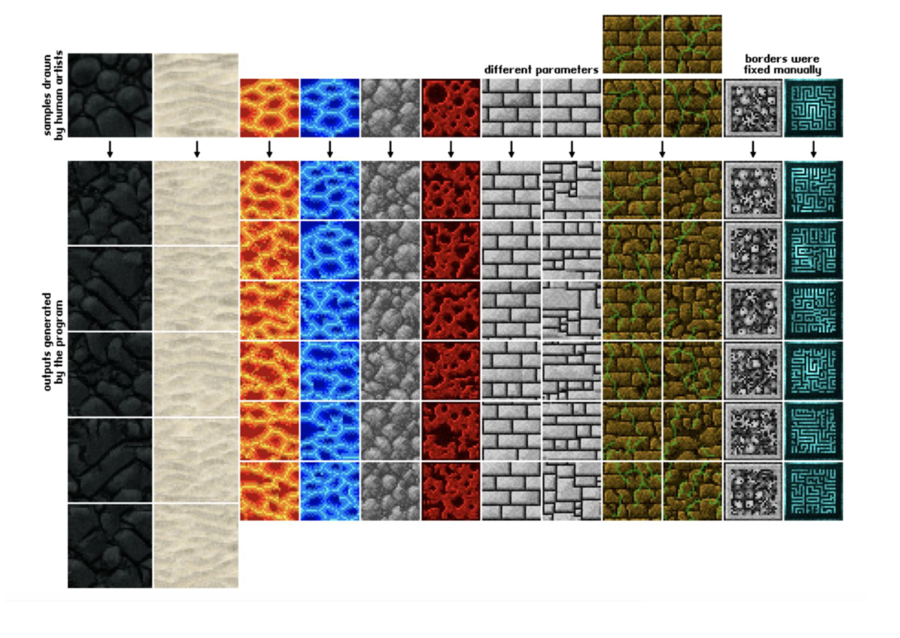

## Summary

Texture synthesis is an image-generation technique commonly used to produce high-quality textures when rendering synthetic graphics. In this project we used multithreading with OpenMP to parallelize an algorithm called non-parametric sampling for texture synthesis.

## Background

Define texture as some visual pattern of an infinite 2D plane. Texture synthesis is the process of taking a finite fixed shape sample from a texture to generate other samples of a different dimension from the given texture. Potential graphic applications of texture synthesis include image de-noising, occlusion fill-in, image compression, etc. Below are some examples of inputs and respective sample outputs of texture synthesis. The first row represents the input (a fixed n by n sample), the bottom rows are the output generated by the program.
<p><br></p>

## Usage
First, clone the repository:
```
git https://github.com/rosieswj/ParallelTextureSynthesis.git
```
Open local repository and run ```make``` under folder ```texturesyn```. This will generate an executable ```texturesyn```  capatible with the following commands:
```
./texturesyn -s SFILE -o OFILE -w WINDOW -r RADIUS [-t THD] [-I]
   -s SFILE         Sample file path
   -o OFILE         Output file path (no file extension required)
   -w WINDOW        Window size
   -r RADIUS        Output radius
   -t THD           Number of threads
   -I               Instrument simulation activities
   -h               Print this message
```
For example,
```
./texturesyn -s src/sample1.ttr -o out/sample1 -w 10 -r 100 -I -t 8
```
will run the program with 8 threads and generate an output image ```sample1_10_100.ppm``` in ```./out/``` folder.


